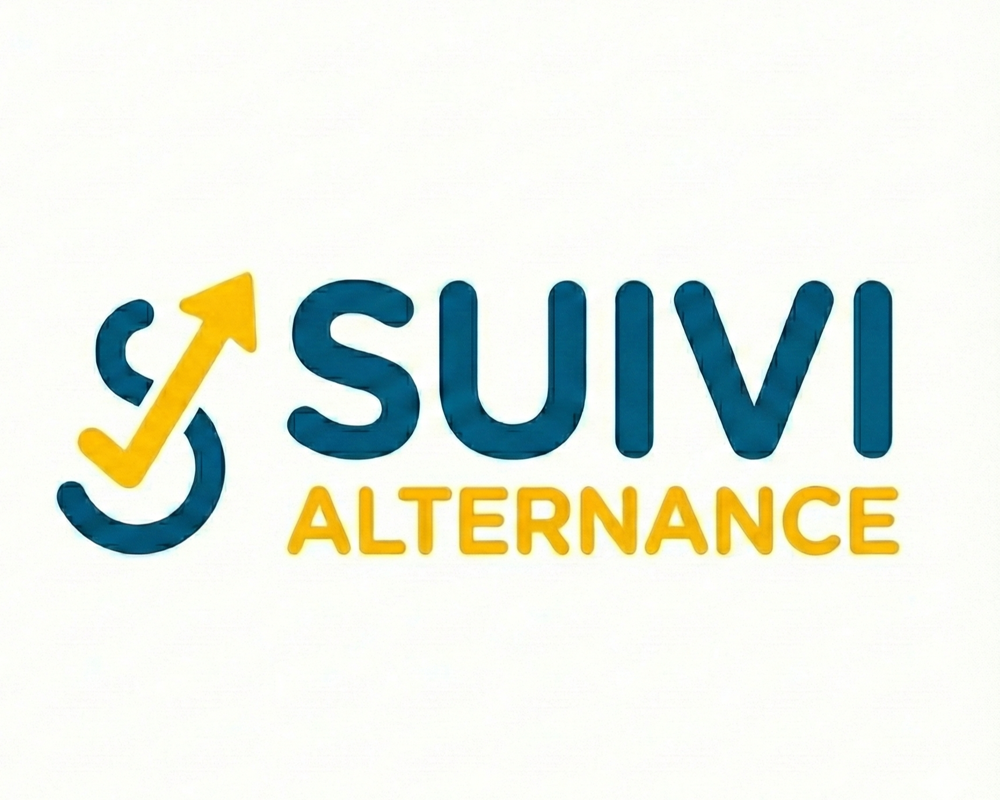

  
  
  # 🎯 Suivi Alternance
  **Le tableau de bord pensé par une étudiante, pour les étudiants.**

  
  
  
  
  

---

## 📝 Le Concept

**Suivi Alternance** est né d'un besoin personnel : survivre à la jungle des candidatures étudiantes. 
Oubliez les tableaux Excel interminables et les favoris dans le navigateur. Cette application centralise absolument tout votre processus de recrutement dans une interface claire, fluide et intelligente.

> 🔒 **Note sur le code source** : 
> L'application manipulant des données personnelles et intégrant des mécanismes d'authentification réels, le dépôt contenant le code source complet est privé par mesure de sécurité. Ce dépôt sert de vitrine technique. **[Vous pouvez tester l'application complète via le mode Démo ici !](https://suivi-alternance-bysouarghi.vercel.app/)**

---

## 🚀 Fonctionnalités Clés

### 1. Gestion Intégrale des Offres
- **Vues dynamiques** : Passez d'une liste détaillée à un tableau Kanban intuitif pour visualiser votre tunnel de recrutement.
- **Archive de sécurité** : Copiez le texte intégral de l'annonce pour ne jamais être pris au dépourvu si l'entreprise supprime l'offre.
- **Onglets de Suivi** : Un système de prise de notes avancé séparé par contexte (*Général, Dates clés, Entretiens, Relances*).

### 2. Automatisation & Rappels
- **Routine du Matin** : Un tracker interactif pour ne jamais oublier de vérifier vos Job Boards favoris (LinkedIn, Welcome to the Jungle, JobTeaser...).
- **Suivi des Relances** : Calcul automatique des dates idéales de relance (J+15) avec des indicateurs de couleur pour agir au bon moment.

### 3. Outils Étudiants (Focus CY Tech)
- **Espace Cloud** : Stockez et accédez à tout moment à votre CV "ATS" (pour les robots) et votre CV "Humain" (pour les recruteurs).
- **Ressources intégrées** : Un guide des bonnes pratiques (Pitch, CV) et des liens rapides vers les plateformes scolaires essentielles.

---

## 🛠 Stack Technique

Ce projet est une **Progressive Web App (PWA)** développée selon les standards modernes du web.

| Côté Front-End | Côté Back-End (BaaS) |
| :--- | :--- |
| ⚛️ **React.js (Vite)** : Pour des composants réactifs et ultra-rapides. | 🗄️ **Supabase (PostgreSQL)** : Base de données relationnelle sécurisée. |
| 🎨 **Tailwind CSS** : Design system sur-mesure, 100% responsive. | 🔐 **Supabase Auth** : Gestion des sessions utilisateurs. |
| 🖌️ **Lucide-React** : Typographie iconographique moderne. | 📦 **Supabase Storage** : Hébergement cloud des fichiers PDF (CV). |

---

## 🛡️ Engagement RGPD

La vie privée n'est pas une option. L'application intègre nativement :
- **L'export des données** : Téléchargement de toute la base de données utilisateur au format CSV en un clic.
- **La suppression totale** : Un bouton permet la destruction définitive du compte et des données associées (via des procédures stockées RPC).
- **Isolation RLS** : Les *Row Level Security* de Supabase garantissent que chaque utilisateur ne peut voir et modifier que ses propres données.

---

## 📱 L'avoir toujours sur soi (PWA)

Conçue en "Mobile First", l'application peut être installée directement sur l'écran d'accueil d'un smartphone (iOS via Safari, Android via Chrome) pour offrir une expérience native sans passer par les App Stores.

---

  <b>Développé avec ❤️ et pas mal de café par Sheryne OUARGHI-MHIRI</b>  
  <a href="mailto:sheryne.ouarghi.pro@gmail.com">Contact Email</a> • <a href="https://www.linkedin.com/">Mon Profil LinkedIn</a>

